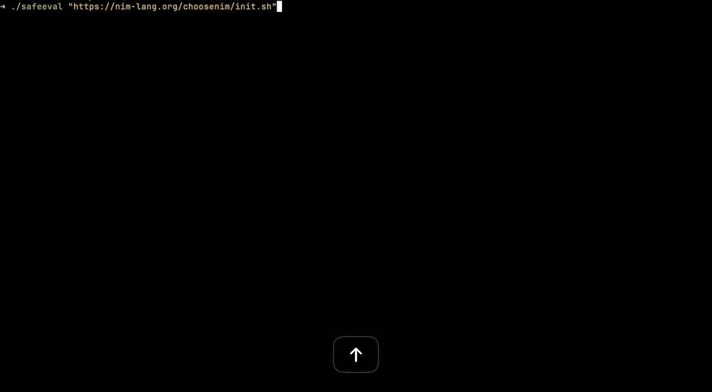

# safeeval

Evaluate shell scripts safely using AI-powered analysis before execution



## Installation

Install globally using npm:

```bash
npm install -g safeeval
```

Or using Bun:

```bash
bun install -g safeeval
```

## Usage

```bash
safeeval <script-url>
```

### Example

```bash
safeeval https://example.com/install.sh
```

### Options

- `--skip-analysis` - Skip security analysis and run the script directly (not recommended)

### Example with skip analysis

```bash
safeeval https://example.com/install.sh --skip-analysis
```

## Configuration

safeeval uses [OpenRouter](https://openrouter.ai/) for script analysis. You need to set up your OpenRouter API key:

1. Get an API key from [OpenRouter](https://openrouter.ai/)
2. Set the environment variable:

```bash
export OPENROUTER_API_KEY=sk-yourapikeyhere
```

Add this to your shell profile (`.bashrc`, `.zshrc`, etc.) to make it permanent.

## Platform Support

safeeval currently supports:
- macOS
- Linux

## Development

### Install dependencies

```bash
bun install
```

### Run locally

```bash
bun run src/index.ts <script-url>
```

### Build executable

```bash
bun run build-exe
```

## License

MIT
